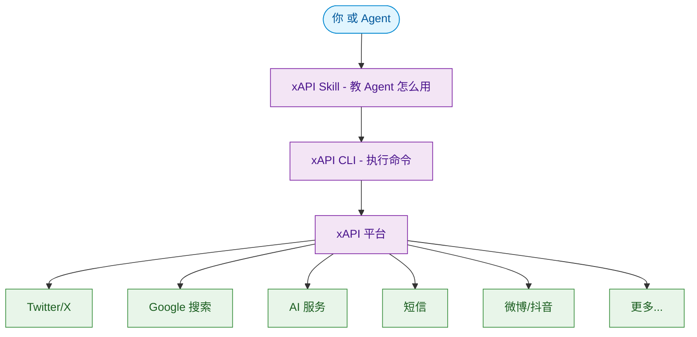
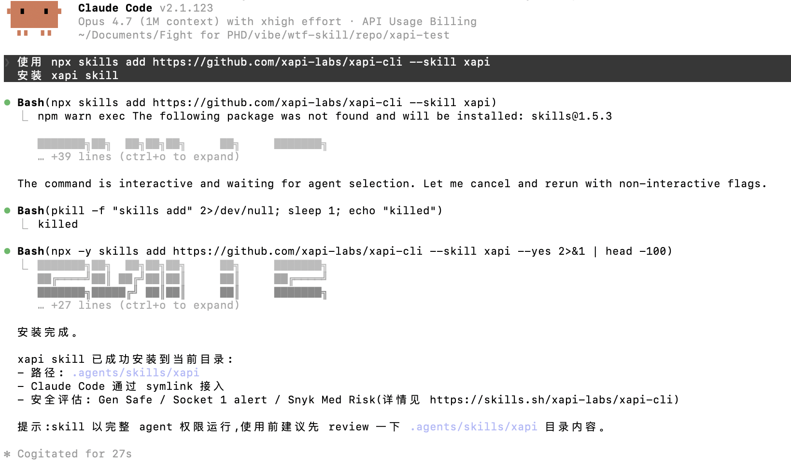
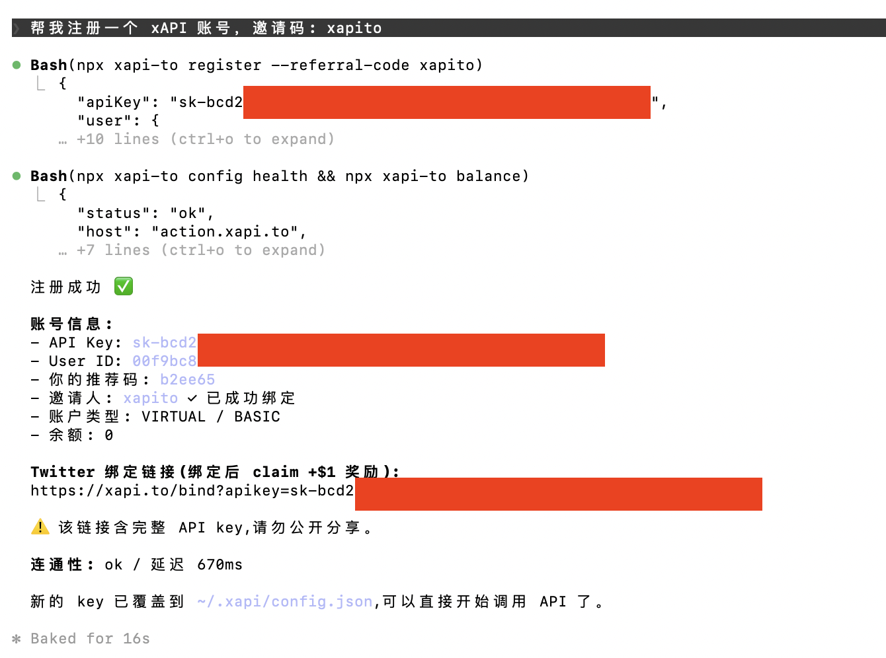
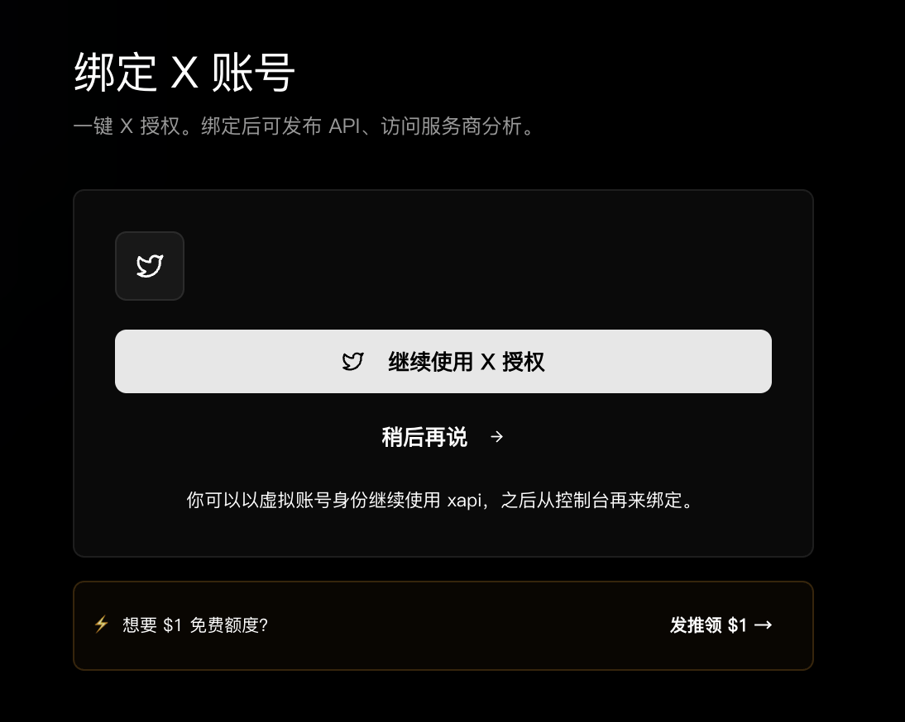
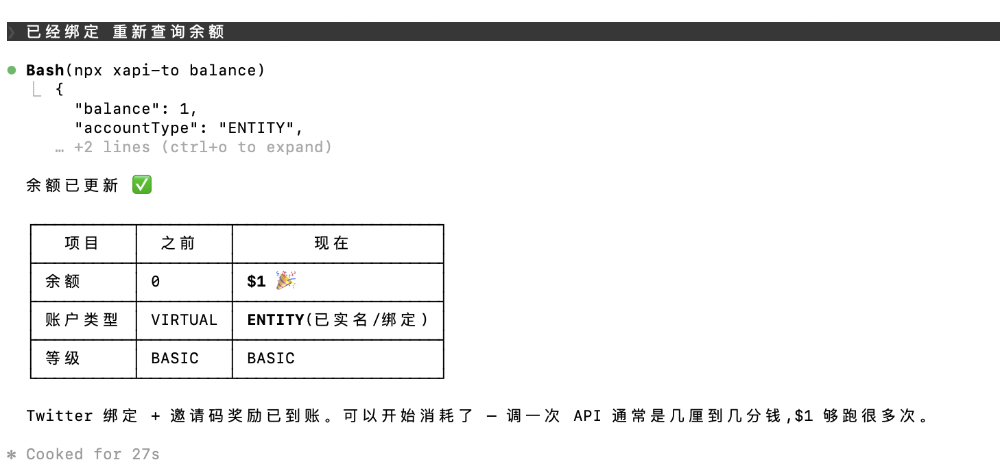
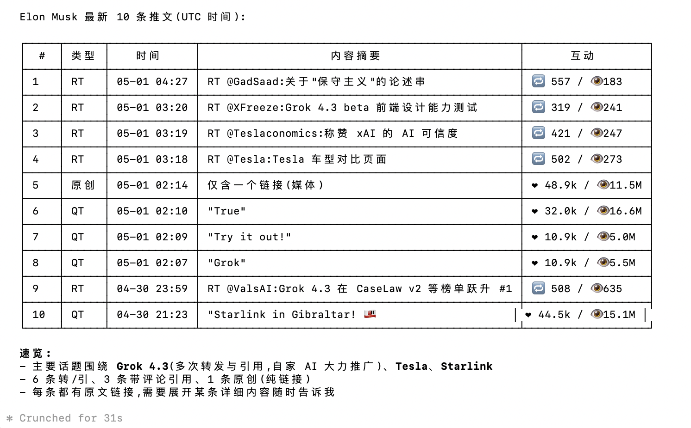
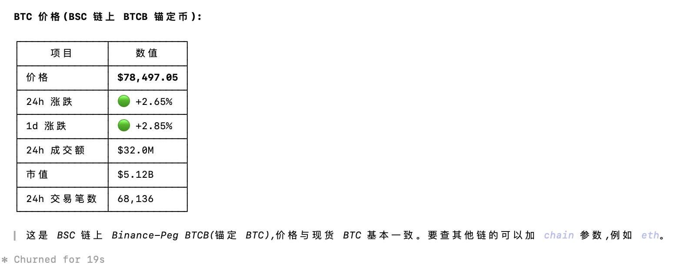
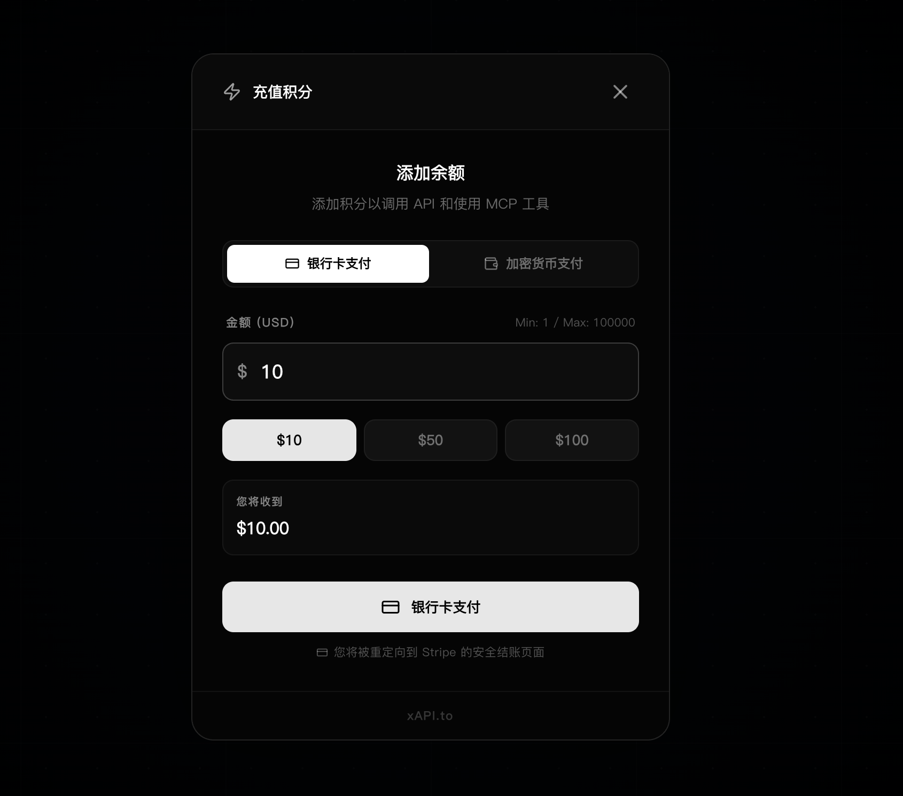
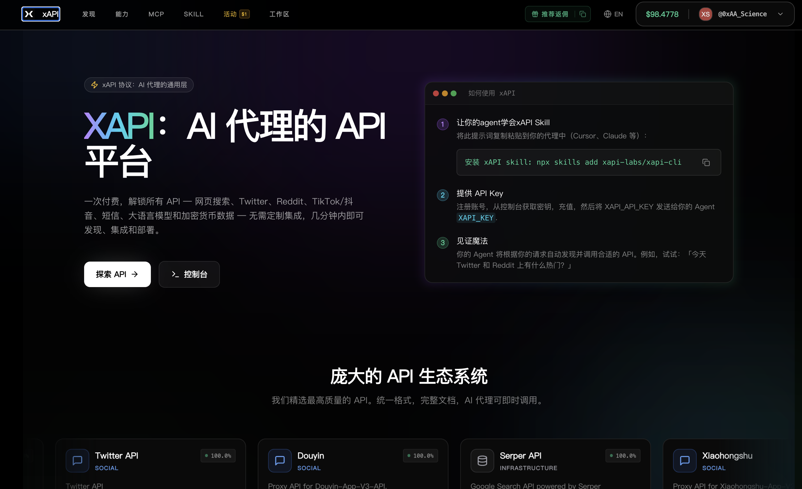

# WTF xAPI极简入门: 1. Hello xAPI

我们最近在研究如何让 AI Agent 方便地调用各种 API，做了 xAPI 这个神器——一个统一的 API 平台，一行命令就能调用 Twitter、Google 搜索、AI 对话、加密货币行情等 19+ 种服务。写一个"WTF xAPI极简入门"，供小白们使用，每周更新 1-3 讲。

> 推特 [@WTFAcademy_](https://twitter.com/WTFAcademy_) ｜ [Discord](https://discord.gg/5akcruXrsk) ｜ [官网 wtf.academy](https://wtf.academy) ｜ [GitHub](https://github.com/WTFAcademy/WTF-xAPI)

---

这一讲，我们用最少的步骤让你的 AI Agent 跑通 xAPI，调用 Twitter，Google搜索等 API。

## 1. 什么是 xAPI

xAPI（[xapi.to](https://xapi.to)）是一个 **Agent 友好的统一 API 平台**：一个 API Key、一行命令，就能调用 Twitter、Google 搜索、AI、短信、加密货币行情等 19+ 种服务，输出统一为结构化 JSON。

下面这张图展示了 xAPI 的整体架构：



下面我们先介绍两个重要组件：**Skill**（教 Agent 怎么用）+ **CLI**（实际执行命令）。

### 1.1 xAPI Skill

**xAPI Skill 是 Agent 的操作手册**——教 Agent 如何通过 xAPI 自己发现 API、查询参数并发起调用，而不是预先记住所有接口，因为 xAPI 上的 API 太多了。

装上 Skill 之后，你只需要用自然语言说"帮我查 Elon Musk 最新推文"，Agent 就知道该调用哪个 API、怎么组装参数。

xAPI Skill 源码完全开源：[SKILL.md](https://github.com/xapi-labs/xapi-cli/blob/main/skills/xapi/SKILL.md)

### 1.2 xAPI CLI

**CLI 是实际执行 API 调用的命令行工具**，命令是 `npx xapi-to`。无论是 Agent 自动调用，还是你手动操作，最终都是通过 CLI 执行。

xAPI CLI 源码也完全开源：[xAPI CLI](https://github.com/xapi-labs/xapi-cli)


### 1.3 Skill + CLI 如何配合


简单理解：**Skill 教 Agent 怎么用，CLI 帮 Agent 跑起来**。两者缺一不可。

## 2. 让你的 Agent 使用 xAPI

下面以 Claude Code 为例，4 步就能让 Agent 帮你调用 xAPI。

### 2.1 安装 xAPI Skill

直接对 Agent 说：

```bash
使用 npx skills add https://github.com/xapi-labs/xapi-cli --skill xapi 
安装 xapi skill
```

以 Claude Code 为例： 



> Skill 装好后，Agent 会**自动安装并使用 xAPI CLI**——你不需要单独装 CLI，也不用记任何命令。但你可能需要重启 Agent 来加载新安装的 Skill：对于 Claude Code，如果你输入 /xapi 能显示相应的 Skill，说明安装成功！


### 2.2 让 Agent 注册 xAPI 账号

直接对 Agent 说：

> 帮我注册一个 xAPI 账号，邀请码 xapito

Agent 会自动执行 `npx xapi-to register`，引导你完成注册，并把 API Key 保存到本地配置文件。注册完之后，你就拥有了访问所有 API 的权限。

以 Claude Code 为例：




> 在你绑定推特/X账户之前，一定要妥善保存你的 xAPI API Key，不然可能会丢失账号。

### 2.3 绑定推特/X

你可以用推特/X绑定 xAPI 账号，更好的管理 API Key，并防止账号丢失。

使用浏览器访问上一步返回的绑定链接 `https://xapi.to/bind/?apikey=sk-bcd209...`，然后使用推特/X登陆进行授权，完成绑定。



如果你注册时使用了邀请码，绑定成功后可以获得免费的 $1 额度，可以用于调用 xAPI 上的服务。




### 2.4 调用 API 示例

用自然语言告诉 Agent 想做什么，比如：

> 抓一下 Elon Musk 最新的 10 条推文

Agent 会自动找到 `twitter.user_tweets` 这个 API、填好参数、执行并返回结果。**你完全不需要记 API 名字和参数**。



> 查一下比特币现在的价格

Agent 会自动组装并执行：



> 查一下当前微博热搜前10


xAPI 还有更多功能，你可以先自行探索，我们也会在之后的教程中继续介绍。

### 2.5 充值（可选）

xAPI 是按调用次数计费的（Pay-as-you-go），使用邀请码注册并绑定推特后会自动得到 $1 免费额度，足够入门体验（调用 5000 次推特API，或 500 次谷歌搜索）。需要充值时，对 Agent 说：

> 帮我给 xAPI 账号充 10 美元，使用信用卡

Agent 会返回一个链接，用浏览器打开它完成充值：



充值成功后，你可以让 Agent 查询余额，然后尽情的调用 API！

## 3. xAPI.to 网站

除了让 Agent 操作，你也可以在 [xapi.to](https://xapi.to) 网站直接管理：

- **浏览所有 API**：[xapi.to/discover](https://www.xapi.to/discover) 查看 20 种服务、几百个 API 的列表和文档
- **管理 API Key**：登录后在 Dashboard 查看、重置 API Key
- **充值与账单**：网页端支付、查看历史调用和消费明细
- **绑定第三方账号**：网页 OAuth 授权 Twitter、微博等账号



## 4. 总结

这一讲我们认识了 xAPI 的两个核心：**Skill**（教 Agent）+ **CLI**（执行命令）；并用 4 步让 Agent 跑通了完整流程：装 Skill → 注册账号 → 绑定推特 → 自然语言调用 → 充值。

接下来你不再需要记 API 名字和参数——直接告诉 Agent 想要什么数据就行。

下一讲我们直接上手最热门的场景——**Twitter 数据读取**，看看 Agent 用 xAPI 抓取推特的真实威力。

