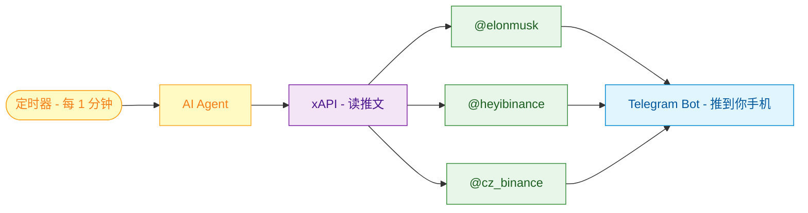
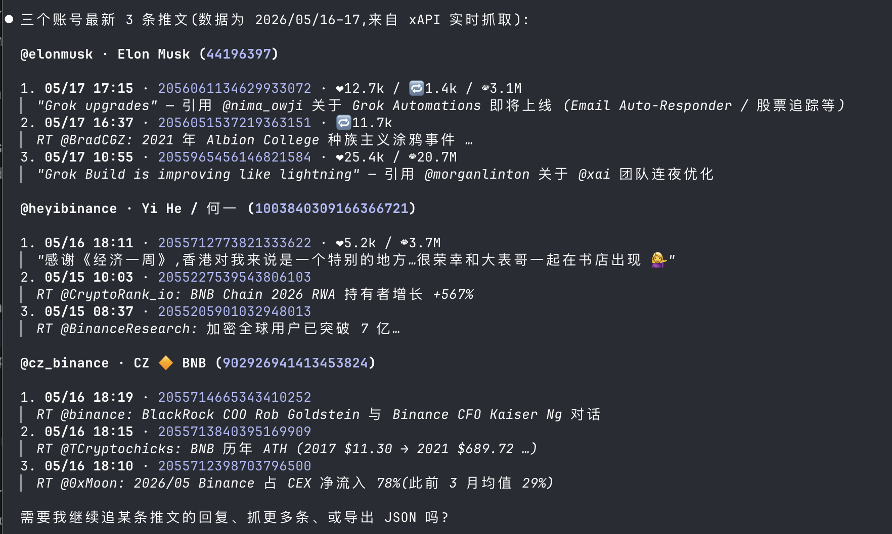
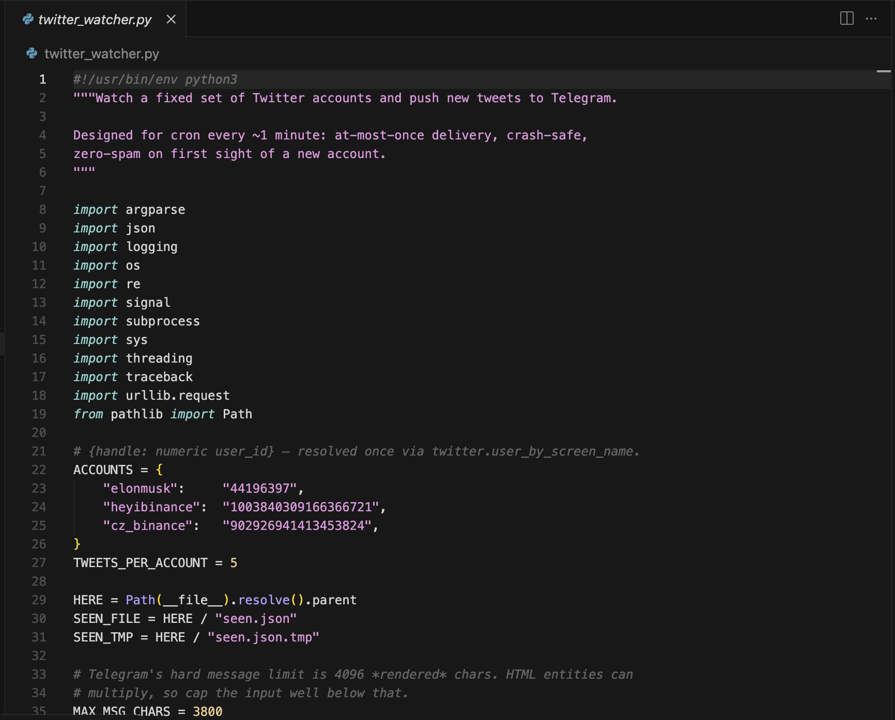
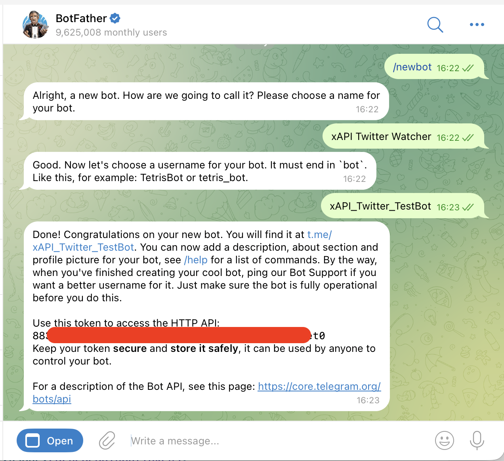
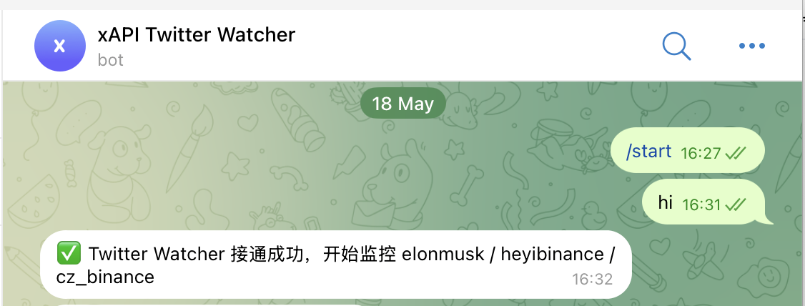
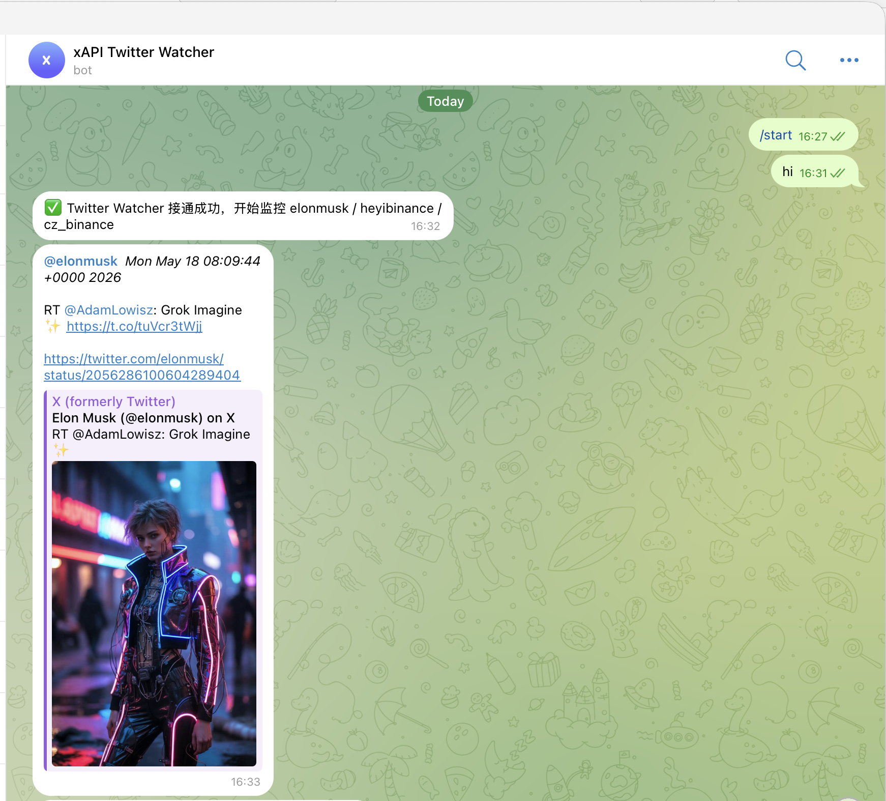

# WTF xAPI极简入门: 2. 推特监听机器人

我们最近在研究如何让 AI Agent 方便地调用各种 API，做了 xAPI 这个神器——一个统一的 API 平台，一行命令就能调用 Twitter、Google 搜索、AI 对话、加密货币行情等 19+ 种服务。写一个"WTF xAPI极简入门"，供小白们使用，每周更新 1-3 讲。

> 推特 [@WTFAcademy_](https://twitter.com/WTFAcademy_) ｜ [Discord](https://discord.gg/5akcruXrsk) ｜ [官网 wtf.academy](https://wtf.academy) ｜ [GitHub](https://github.com/WTFAcademy/WTF-xAPI)

---

上一讲我们让 Agent 跑通了 xAPI，一句话就能调 Twitter、Google 搜索、加密货币行情。这一讲，我们就用这套能力做点**真正有用**的东西——一个**推特监听Bot**：自动盯着 Elon Musk、何一、CZ 这些大佬的推特，一有新推文就第一时间推到你的 Telegram。

## 1. 整体架构

这个监听Bot把三块拼起来：**xAPI 读推文 + Agent 定时执行 + Telegram 推送**，流程图如下：



整套流程分 4 步：

1. 让 Agent 用 xAPI 试着读一下三位大佬的推文
2. 让 Agent 写一个监听脚本（读推文 → 去重 → 推 Telegram）
3. 在 Telegram 创建 Bot，将 token 发给 Agent，让监控 Bot 第一时间推送到你的 Telegram。
4. 用 Agent 的定时功能让脚本每 1 分钟跑一次，定时推送最新消息。

下面我们逐步拆解。

## 2. 用 xAPI 读推文

正式写脚本之前，先让 Agent 用 xAPI 把三位大佬的推文跑一遍，验证链路是通的。直接对 Agent 说：

```plaintext
/xapi 用 xAPI 抓 `elonmusk`、`heyibinance`、`cz_binance` 这三个账号最新的 3 条推文
```

Agent 会自动按 xAPI Skill 教的"**先 `user_by_screen_name` 拿数字 ID（`rest_id`）→ 再 `user_tweets` 拿推文**"模式跑一遍，并输出结果：



如果你还没有安装 xAPI skill 或注册账号，请参考教程的[第一讲](../01_HelloXAPI/readme.md)。

## 3. 让 Agent 写监听脚本

链路测试成功后，让 Agent 写推特监听脚本：

```plaintext
/xapi 帮我写一个 Python 脚本 `twitter_watcher.py`，做 3 件事：
1. 用 xAPI 抓 `elonmusk`、`heyibinance`、`cz_binance` 三个账号最新 20 条推文（包含转推和回复）
2. 用 `seen.json` 记录每个账号已推送的"高水位 id"
3. 把新推文通过 Telegram Bot API 推到我聊天

## 关键约束

- **状态**：用 per-account `max_id` 高水位（字符串），不要 id 集合——
  snowflake 单调递增，比集合稳，自然避开 pinned tweet 重推。
  新账号 (`handle not in seen`) 只 snapshot newest_id，**不推**。
  `seen.json` 用 `tmp + os.replace` 原子写；每发成功一条立刻 flush。

- **安全**：所有 xAPI 字段（`full_text`/`created_at`/...）经 HTML escape
  才能进 message；最终 message 截到 ~3800 字符（4096 是 rendered 上限，
  escape 会膨胀）；链接从 validated handle `[A-Za-z0-9_]{1,15}` + 数字 id
  自己构造，**不回显 `tweet.url`**。

- **健壮**：xAPI 响应必须先校验 `success` 字段（否则余额耗尽时 KeyError
  让 cron 崩）；subprocess `timeout=30`、urlopen `timeout=15`；Telegram 
  POST 用 `application/json`（form-urlencoded 长 text 会坑），
  `disable_web_page_preview` 字段是 `bool` 不是字符串；单账号失败用 
  `traceback.print_exc()` + `continue`，不阻塞其他账号。

- **工程**：`ACCOUNTS = {handle: user_id}` 一次性写死，省每次 
  `user_by_screen_name` 查询；用 `logging` 带 timestamp 不要裸 `print`。

目标：cron 每分钟跑一次 或 --loop 进程内使用 threading.Event.wait() 调度，at-most-once，不爆群。
```

Agent 会生成类似下面这样的脚本：



## 4. 创建 Telegram Bot

### 4.1 在 BotFather 拿 Token

打开 Telegram，搜索 **@BotFather**（注意是蓝V认证的官方账号），开始对话：

1. 发 `/newbot`
2. 给 Bot 起一个**显示名**，比如 `xAPI Twitter Watcher`
3. 给 Bot 起一个**用户名**，必须以 `bot` 结尾，比如 `wtf_twitter_testbot`
4. BotFather 会返回一串 Token，长这样（**⚠️ Token 等同于密码**）：

```
123456789:ABCdefGHIjklMNOpqrSTUvwxYZ1234567890
```




### 4.2 打通 Telegram 推送

Bot 不能凭空给陌生人发消息，必须先知道你的 **Chat ID**：**你需要主动给你新建的 Bot 发一条消息**（什么都行，例如 `hi`）—— Bot 必须先收到过你的消息才能反过来推你信息。

在 Telegram 搜 **@wtf_twitter_testbot**（你刚才给Bot起的用户名），给它发 `hi`。



发完之后，把 Bot Token （替换你上一步拿到的真实 Token）和你已经和 Bot 对话过的信息告诉 Agent，让他帮你配置：

```plaintext
我已经申请好了 Telegram Bot，并且已经和他对话 /start 了，请帮我配置并测试。
Token: 123456789:ABCdefGHIjklMNOpqrSTUvwxYZ1234567890
```

Agent 帮你配置好 Telegram Bot 环境变量后，你的 Telegram 会收到测试信息：




## 5. 运行监听 Bot

现在脚本和 Telegram 通道都配置好了，你可以和 Agent 说：

```plaintext
请运行推特监听脚本，每分钟监听最新推文并推送
```

Agent 就会运行推特监听机器人，让你在 TG 收到 Elon, 何一和 CZ 的最新推文了。

## 6. 改进方向

目前的监听 Bot 非常简单，有很大的改进空间，这里给出几个思路：

1. 监听更多的 KOL。
2. 增加监听频率，但是成本会同比上升。
3. 将监听脚本工程化。
4. 监听更多社交媒体xAPI 也提供了微博、抖音、Reddit、Tiktok 等社交媒体的接口。

## 总结

这一讲，我们用 **xAPI + Agent + Telegram** 三个组件，做了简单的推特监听Bot：每分钟监听 Elon, 何一和 CZ，并通过 Telegram 推送到手机。整个过程不需要你写代码。

下一讲，我们将介绍如何做一个自动发推机器人🤖！
