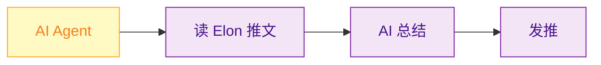
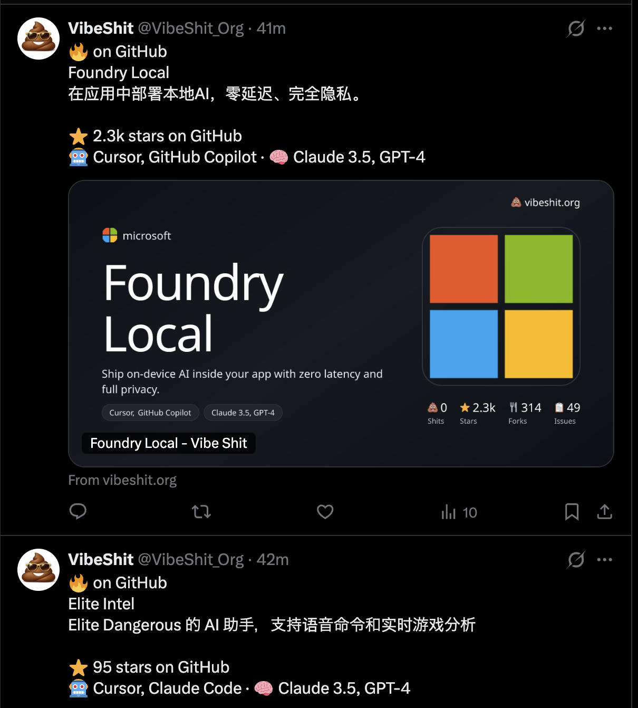
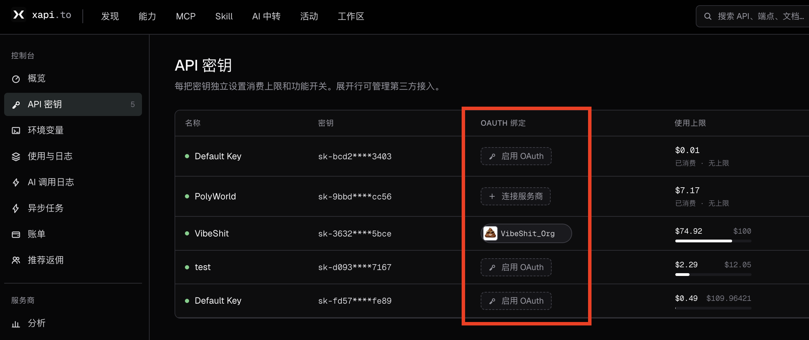
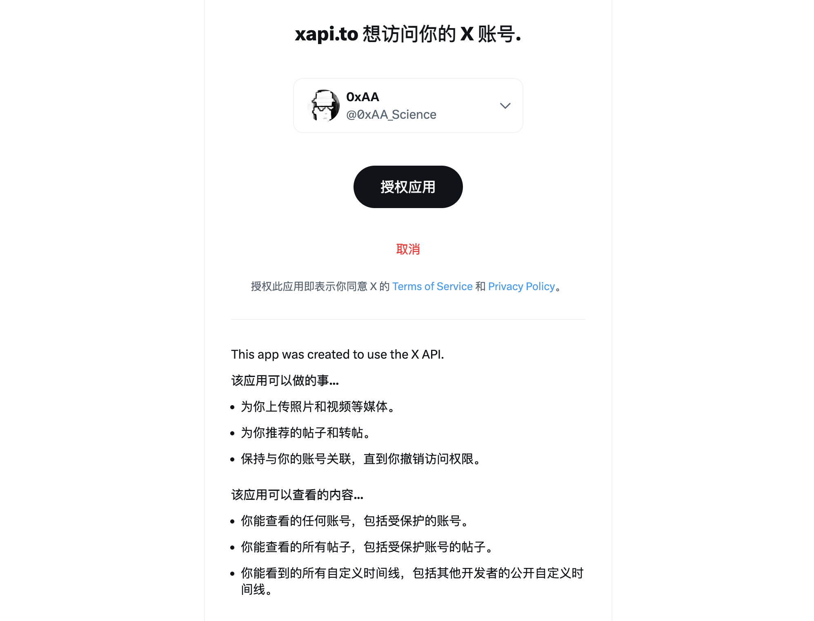
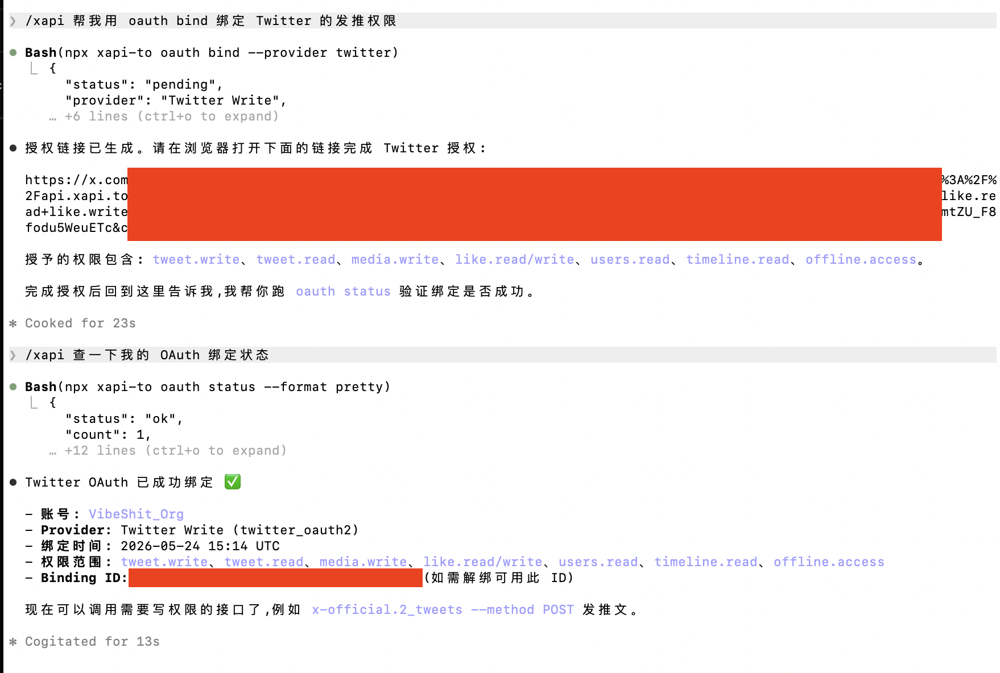
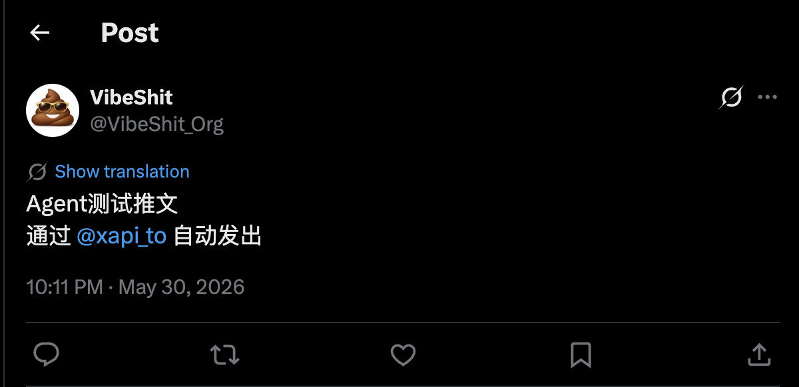
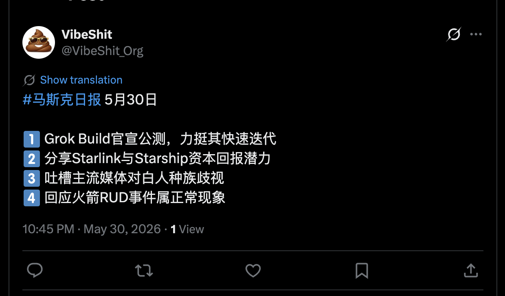

# WTF xAPI极简入门: 3. 自动发推机器人

我们最近在研究如何让 AI Agent 方便地调用各种 API，做了 xAPI 这个神器——一个统一的 API 平台，一行命令就能调用 Twitter、Google 搜索、AI 对话、加密货币行情等 19+ 种服务。写一个"WTF xAPI极简入门"，供小白们使用，每周更新 1-3 讲。

> 推特 [@WTFAcademy_](https://twitter.com/WTFAcademy_) ｜ [Discord](https://discord.gg/5akcruXrsk) ｜ [官网 wtf.academy](https://wtf.academy) ｜ [GitHub](https://github.com/WTFAcademy/WTF-xAPI)

---

上一讲我们做了监听机器人，监听最新推文并推送到你的手机。这一讲我们做发推机器人，让 Agent 通过 xAPI **自动发推**。

## 1. 整体架构

这一讲，我们会做一个**Elon Musk 总结机器人**，每天定时抓 `@elonmusk` 过去 24 小时的推文，用 AI 总结成一条推文，并自动发送。这个 Bot 把 xAPI 的三个能力串成一条流水线：**读推文 + AI 总结 + 发推**



整套流程 3 步：

1. 在 xAPI 给 API Key 绑定 X 账号（Twitter OAuth）的**发推**权限。
2. 让 Agent 发测试推文，验证授权成功。
3. 让 Agent 写一个自动发推脚本（抓 → 总结 → 发 → 按日期去重），每天跑一次。

下面我们逐步拆解。

## 2. 给 xAPI 开通发推权限

第 1 讲我们绑过一次 Twitter——那是把 xAPI **账号**绑到你的 X，主要用于身份认证。但**调 Twitter 写 API**（发推、点赞、转推）是另一回事，需要单独的 OAuth 授权。

xAPI 支持将 Twitter/X 等社交媒体的功能 OAuth 授权给你的 API Key，这样你用 xAPI 的 API Key 就能调用推特官方接口，完成发推/转发/点赞等功能。你可以通过 Agent 或者网页两种方式进行 OAuth 授权。

比如 [推特 @VibeShit_org](https://x.com/VibeShit_Org) 一直是 Agent 利用 xAPI 的发推功能自动发推的，已经正常运行3个月了。



> 对于需要授权推特/X账号的 API，xAPI 走的是推特/X官方的API。只要你发的内容符合推特政策，并且频率正常，封号风险可控，冻结了也可以申诉解封。

### 2.1 网页授权

你可以访问 xAPI 网页进行授权: https://www.xapi.to/console?tab=keys 

如图点击对应 API Key 的 OAuth 绑定，点击**连接服务商**，然后点击 Twitter Write 进行授权。



然后你选择要授权的权限，然后点击继续授权，网页会引导你进入推特授权页，点击授权应用完成授权。：



授权成功后，你会看到 API Key 的 OAuth 绑定栏显示对应的推特头像和昵称。

### 2.2 Agent 授权

你也可以通过 Agent 进行 OAuth 授权，将推特的相应权限授权给 API Key。直接对 Agent 说：

```plaintext
/xapi 帮我用 oauth bind 绑定 Twitter 的发推权限
```

Agent 会返回一个授权链接，你需要在浏览器打开点确认授权。


绑定完成后再让 Agent 核对一下：

```plaintext
/xapi 查一下我的 OAuth 绑定状态
```

如果绑定成功，Agent 会告诉你。



## 3. 发送测试推文

写正式的发推脚本之前，先用 Agent 发送测试推文，测试授权是否成功。你可以对 Agent 说：

```plaintext
/xapi 帮我发送测试推文，内容：
Agent测试推文
通过 @xapi_to 自动发出
```

你可以打开你的推特主页，查看 Agent 是否成功通过 xAPI 自动发推成功，[示例链接](https://x.com/VibeShit_Org/status/2060725803239756169)。




## 4. 让 Agent 写自动发推脚本

发推功能测试完毕后，让 Agent 做一个每天定时"抓 Elon Musk 推特 → 总结 → 发推"的工作流：

```plaintext
/xapi 帮我完成一个**Elon Musk 日报机器人**，每天抓取 Elon Musk 推文，总结，然后发推。工作流包含3部分：
1. 抓取 @elonmusk 最近 100 条推文，然后过滤出近 24 小时的推文
2. 用 AI 总结成一条 ≤200 字符的中文推文
3. 将总结推文发推，并记录避免重复发推。

要求：
1. 开头： #马斯克日报 {today}
2. 同主题合并;突出产品/人名/数字/事件;带上马斯克的态度。
3. 如果有多个主题，用 1️⃣ ... 2️⃣ ... 3️⃣ ... 列出，不同主题之间要换行。
4. 客观提炼,不替马斯克下结论,不要输出引号、Markdown 符号、解释、思考过程、开场白
```

Agent 写好脚本后，会部署一个定时任务，每天运行并自动发推，代码示例见[链接](./musk_summary_bot.py)：



## 总结

这一讲我们把 xAPI 的"写"能力跑通了：**OAuth 绑定 → 抓 Elon 推文 → AI 总结 → 自动发推**。和第 2 讲的监听机器人合在一起，你已经有了一对能读会写的推特 Agent。

Agent + 推特/X 权限，你能开发出什么样的bot呢？发挥你的想象力！

